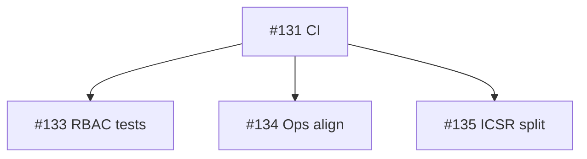

# Engineering hardening (post v1.5)

**Status**: Complete  
**Project**: qppv-agent  
**Driver**: Khalid code-quality assessment (Aug 2026) — overall 3.5/5; architecture ahead of continuous verification.  
**Completed**: 2026-08-07 ([#175](https://github.com/Dr-kersho/QPPV-Agent/issues/175))

## Goal
Close the highest-leverage quality gaps without new product scope: CI, RBAC tests, ops BFF/Dockerfile align, then ICSR surface split.

## Milestones

### Milestone 1 — PR CI gate
- **Status**: done
- **Filed as**: [#131](https://github.com/Dr-kersho/QPPV-Agent/issues/131) (closed)
- **Success**: pytest + ruff + tsc + lint + next build on every PR to main

### Milestone 2 — RBAC HTTP tests
- **Status**: done
- **Filed as**: [#133](https://github.com/Dr-kersho/QPPV-Agent/issues/133) (closed)
- **Blocked by**: prefer after #131
- **Success**: qa_readonly write-block + seat roles covered at HTTP level

### Milestone 3 — Ops BFF + Dockerfile
- **Status**: done
- **Filed as**: [#134](https://github.com/Dr-kersho/QPPV-Agent/issues/134) (closed)
- **Success**: admin org-list path and Next standalone Docker path agree

### Milestone 4 — Split ICSR surfaces
- **Status**: done
- **Filed as**: [#135](https://github.com/Dr-kersho/QPPV-Agent/issues/135) (closed)
- **Blocked by**: #131
- **Success**: icsrs router/pages thinned; public paths unchanged

## DAG

